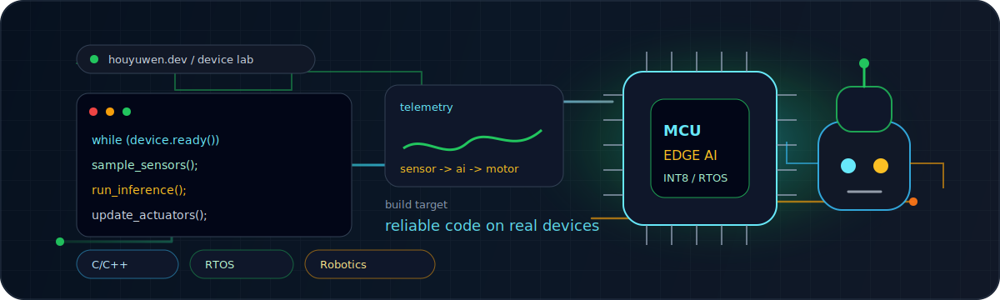

<p align="center">
  
</p>

<h1 align="center">houyuwen</h1>

<p align="center">
  Embedded software, edge inference, robotics control, and platform engineering.
</p>

<p align="center">
  <a href="https://github.com/houyuwen?tab=repositories"></a>
  
  
</p>

---

### Build Vector

I use this profile as a compact map of work around embedded software, device-side intelligence, and practical system building.

| Area | What I care about |
| --- | --- |
| Embedded software | C/C++, drivers, application frameworks, hardware-facing architecture, and reliable control flow. |
| Edge AI | Bringing inference closer to sensors, devices, and real-time decision loops. |
| Robotics and control | Connecting perception, motion, telemetry, and deterministic software behavior. |
| Platform tooling | Building reusable layers that make embedded projects easier to test, ship, and maintain. |

### Project Map

| Repository | Direction |
| --- | --- |
| [Embedded-software-application-framework](https://github.com/houyuwen/Embedded-software-application-framework) | Embedded software architecture and application scaffolding. |
| [CProjects](https://github.com/houyuwen/CProjects) | C/C++ practice, utilities, and low-level building blocks. |
| [PlatNexus](https://github.com/houyuwen/PlatNexus) | Platform-oriented application experiments. |
| [metacc](https://github.com/houyuwen/metacc) | Systems/compiler-oriented exploration. |

### Working Stack

```text
firmware      C/C++ | drivers | RTOS concepts | device workflows
edge-ai       sensors | inference loops | telemetry | model deployment
robotics      control | perception hooks | state machines | diagnostics
platform      Python | tooling | test harnesses | system architecture
```

### Current Direction

- Building embedded software foundations that stay readable under hardware constraints.
- Exploring how AI features can live near devices instead of only in cloud services.
- Turning low-level code, tools, and system design into reusable engineering assets.

<p align="center">
  
  
</p>
